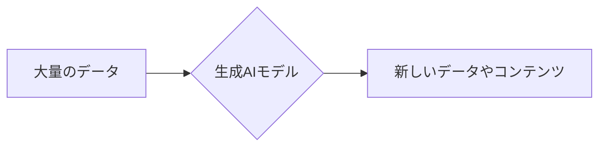
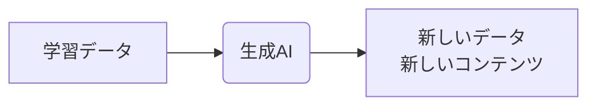
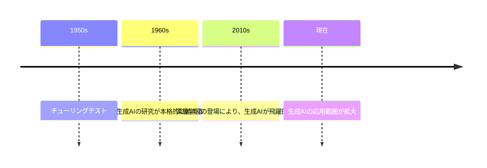
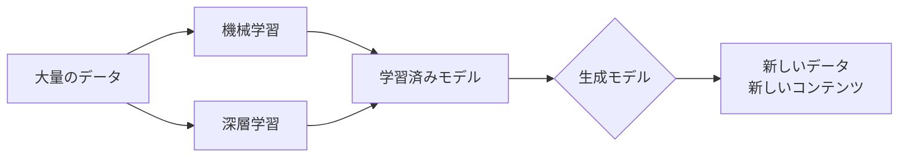
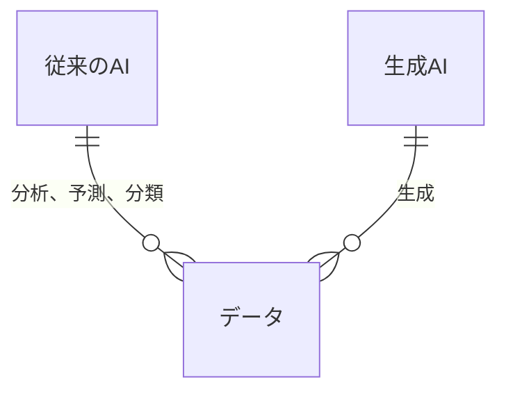
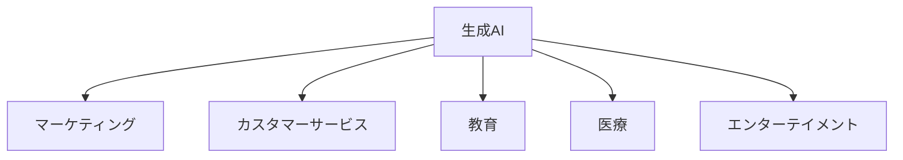

### markdown文章に対応するmermaid構文

# doc_genai_About_the_origins_and_types_of_generative_AI
生成AIの成り立ちや種類について

  
## 生成AIについての資料

  
### 0. 目次

- [1. はじめに](#1-はじめに)
- [2. 生成aiとは？](#2-生成aiとは？)
- [3. 生成aiの成り立ちと歴史](#3-生成aiの成り立ちと歴史)
- [4. 生成aiの動作仕組み](#4-生成aiの動作仕組み)
- [5. 生成aiの種類](#5-生成aiの種類)
- [6. 生成aiと従来のaiの違い](#6-生成aiと従来のaiの違い)
- [7. 生成aiの有用性](#7-生成aiの有用性)
- [8. 生成aiの活用事例](#8-生成aiの活用事例)
- [9. 生成aiの課題と倫理](#9-生成aiの課題と倫理)
- [10. まとめと今後の展望](#10-まとめと今後の展望)
- [閲覧時の注意点](#閲覧時の注意点) 

  
### 1. はじめに

近年、人工知能（AI）技術は飛躍的に進歩しており、その中でも **生成AI (Generative AI)** は大きな注目を集めています。従来のAIがデータ分析や予測を主目的としていたのに対し、生成AIは、学習したデータに基づいて、人間が創造したような新しいデータやコンテンツを生成することを可能にします。

本資料では、生成AIの成り立ち、種類、従来のAIとの違い、動作仕組み、そしてその有用性について解説し、今後の展望について考察します。

  
### 2. 生成AIとは？

生成AIとは、学習データからパターンやルールを学び、それらを元に新しいデータやコンテンツを生成するAIです。テキスト、画像、音声、動画など、様々な種類のデータを生成することができます。従来のAIが「既存データの分析や予測」を主目的としていたのに対し、生成AIは「0から1を生み出す」創造性を持ち合わせています。

  
### 3. 生成AIの成り立ちと歴史

生成AIの基礎は、1950年代にアラン・チューリングが提唱した「チューリングテスト」にまで遡ることができます。その後、1960年代から生成AIの研究が本格的に始まり、近年、コンピューター技術の進化に伴い、より複雑で高度な生成AIモデルが開発されています。

  
### 4. 生成AIの動作仕組み

生成AIは、主に「機械学習」「深層学習」「生成モデル」の3つの技術を組み合わせることで動作します。

* **機械学習:** 大量のデータからパターンや規則を学習します。
* **深層学習:** ニューラルネットワークを用いて、複雑なデータから高度な特徴を抽出します。
* **生成モデル:** 学習したデータに基づいて、新しいデータやコンテンツを生成します。

代表的な生成モデルとしては、**敵対的生成ネットワーク（GAN: Generative Adversarial Networks）** や **変分オートエンコーダ（VAE: Variational Autoencoder）**、 **GPT (Generative Pre-trained Transformer)** などが挙げられます。

  
### 5. 生成AIの種類

生成AIは、生成するデータの種類によって大きく以下の4つに分類されます。

* **テキスト生成AI:** 文章、詩、コード、台本、ニュース記事などを生成します。例えば、ChatGPT、Bardなどが挙げられます。
* **画像生成AI:** 写真、イラスト、絵画などを生成します。例えば、DALL-E、Stable Diffusion、Midjourneyなどが挙げられます。
* **音声生成AI:** 音声、音楽、ナレーションなどを生成します。例えば、WaveNet、Tacotronなどが挙げられます。
* **動画生成AI:** 動画、アニメーションなどを生成します。例えば、Meta AI's Make-A-Video、Google's Imagen Videoなどが挙げられます。

  
### 6. 生成AIと従来のAIの違い

| 項目 | 従来のAI | 生成AI |
|---|---|---|
| 主な目的 | データ分析、予測、分類 | 新しいデータやコンテンツの生成 |
| データへのアプローチ | 既存データからの分析 | 学習データからの生成 |
| 特徴 | 人間が設定したルールに基づいて動作 | データから学習したパターンに基づいて動作 |
| 例 | スパムメールの検出、商品レコメンド | 文章生成、画像生成、音楽生成 |

  
### 7. 生成AIの有用性

生成AIは、様々な分野で革新的な変化をもたらすと期待されています。

* **コンテンツ制作の効率化:** 文章、画像、音声、動画などのコンテンツを自動生成することで、制作コストの削減や効率化が図れます。
* **創造性の促進:** これまで人間では思いつかなかった新しいアイデアや表現を生み出すことが期待できます。
* **パーソナライズ化:** 個別ニーズに合わせたコンテンツやサービスを提供することが可能になります。
* **業務効率化:** 繰り返し作業や定型業務を自動化することで、業務効率化や生産性向上に貢献します。

  
### 8. 生成AIの活用事例

* **マーケティング:** ターゲットに合わせた広告文の作成、ウェブサイトコンテンツの自動生成
* **カスタマーサービス:** 顧客からの質問に自動応答するチャットボット
* **教育:** 個別学習教材の作成、生徒の解答に対するフィードバック生成
* **医療:** 病状の診断支援、創薬、医薬品開発
* **エンターテイメント:** ゲームキャラクターやシナリオの作成、音楽や映画の制作

  
### 9. 生成AIの課題と倫理

生成AIは大きな可能性を秘めている一方、以下のような課題も存在します。

* **倫理的な問題:** 著作権、プライバシー、フェイクニュース、悪用などの問題
* **バイアスと公平性:** 学習データに偏りがあると、生成されるデータも偏ったものになる可能性
* **説明責任と透明性:** 生成AIの意思決定プロセスが複雑で、ブラックボックス化しやすい

  
### 10. まとめと今後の展望

生成AIは、私たちの生活や社会に大きな変化をもたらす可能性を秘めた技術です。今後、技術の進化や倫理的な議論が進展することで、より安全で倫理的な生成AIの活用が進むと考えられています。

  
### 閲覧時の注意点

本資料は、生成AIに関する一般的な情報を提供することを目的としており、特定の目的のために作成されたものではありません。そのため、以下の点にご留意ください。

* **情報の更新**: 生成AIは急速に進化する分野であるため、最新情報は信頼できる情報源で定期的に確認してください。
* **情報の正確性**: 生成AIが出力する情報は必ずしも正確とは限りません。情報源を確認し、自身の判断と専門知識も活用してください。
* **倫理と責任**: 生成AIの利用にあたっては、倫理的な問題、著作権、プライバシー、情報漏洩リスクなどに十分注意し、責任ある行動を心がけてください。
* **利用規約の遵守**: 生成AIサービスを利用する際は、事前に利用規約やポリシーをよく確認してください。
* **過度な依存の回避**: 生成AIはあくまでもツールの一つです。生成AIのみに依存せず、人間の判断や専門知識と組み合わせて活用することが重要です。

